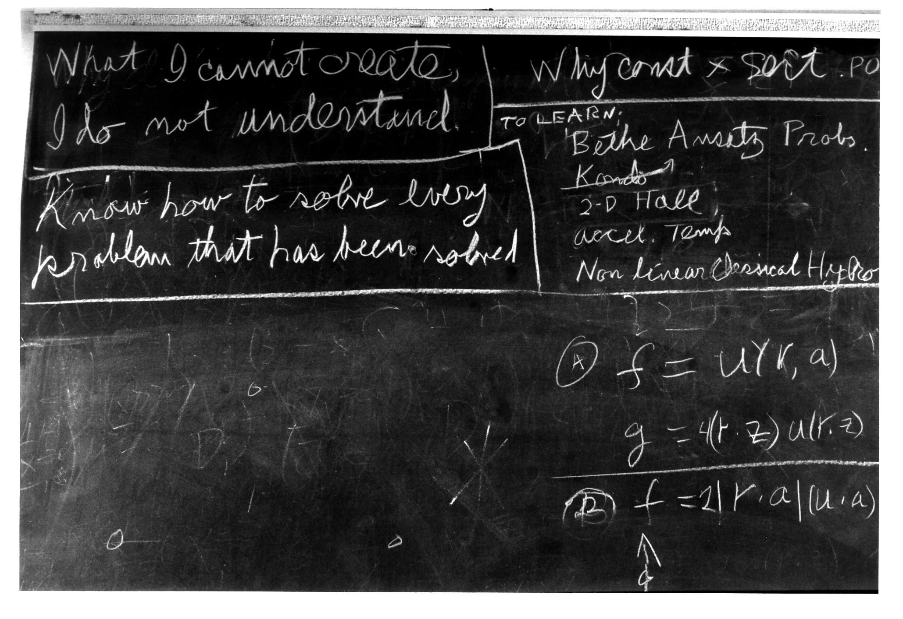

# Running local models

> 2023-11-21, Martin Czygan <martin.czygan@gmail.com>, [L Gopher](https://golangleipzig.space), Open Data Engineer at [IA](https://archive.org)

Short talk about running local models, using Go tools.

## Motivation

I love technology, still not ❤️  black boxes - in Year 73 after [Computing Machinery
and Intelligence](https://phil415.pbworks.com/f/TuringComputing.pdf).

From 2023-07-23: [Understanding ChatGPT is a bold new challenge for science](https://www.nature.com/articles/d41586-023-02366-2.pdf)

> This **lack of robustness** signals a lack of **reliability** in the real world.

> What I cannot build, I do not understand.

Open models not binary:

> We propose a framework to assess six levels of access to generative AI
> systems, from [The Gradient of Generative AI Release: Methods and
> Considerations](https://arxiv.org/pdf/2302.04844.pdf):

* fully closed
* gradual or staged access
* hosted access
* cloud-based or API access
* downloadable access and
* fully open.

## Credits

* [Richard Feynman's blackboard at time of his death](https://digital.archives.caltech.edu/collections/Photographs/1.10-29/) (1988)
